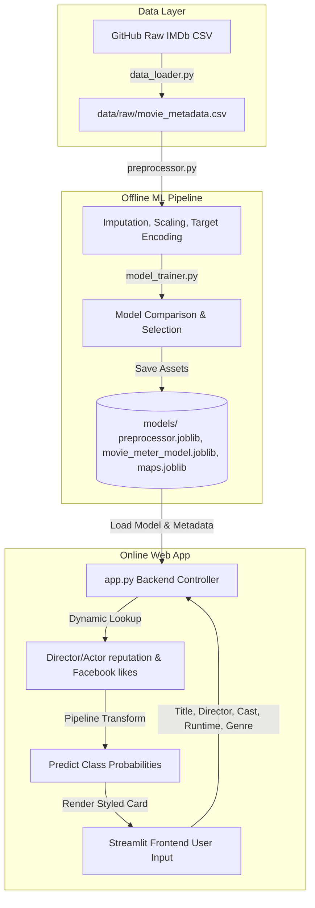
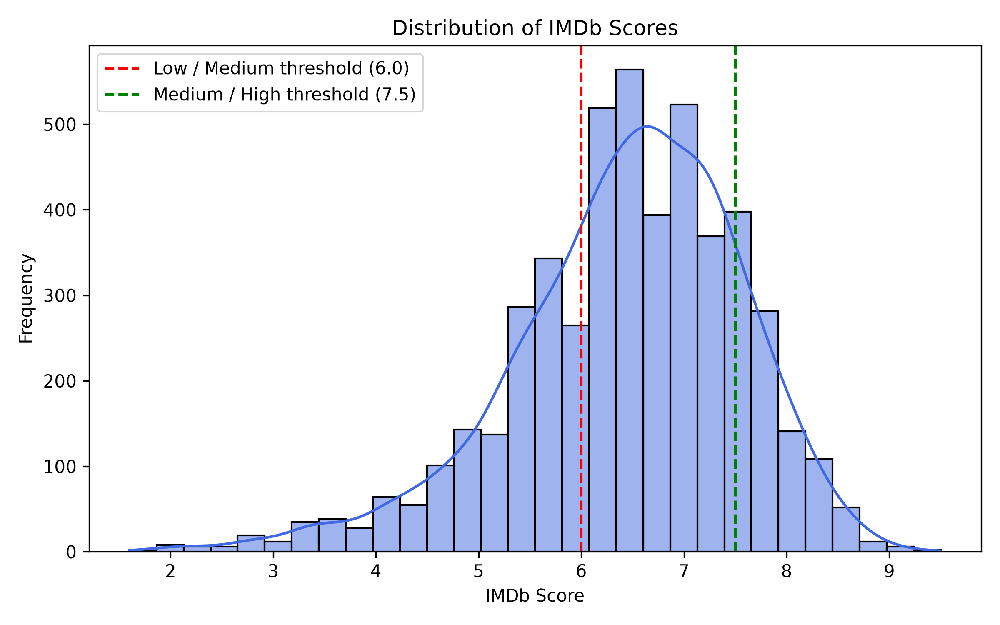
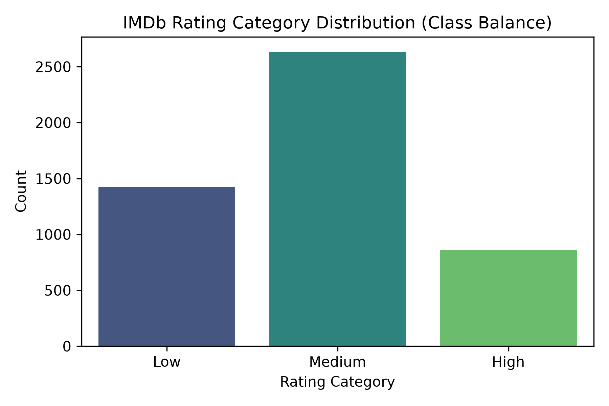
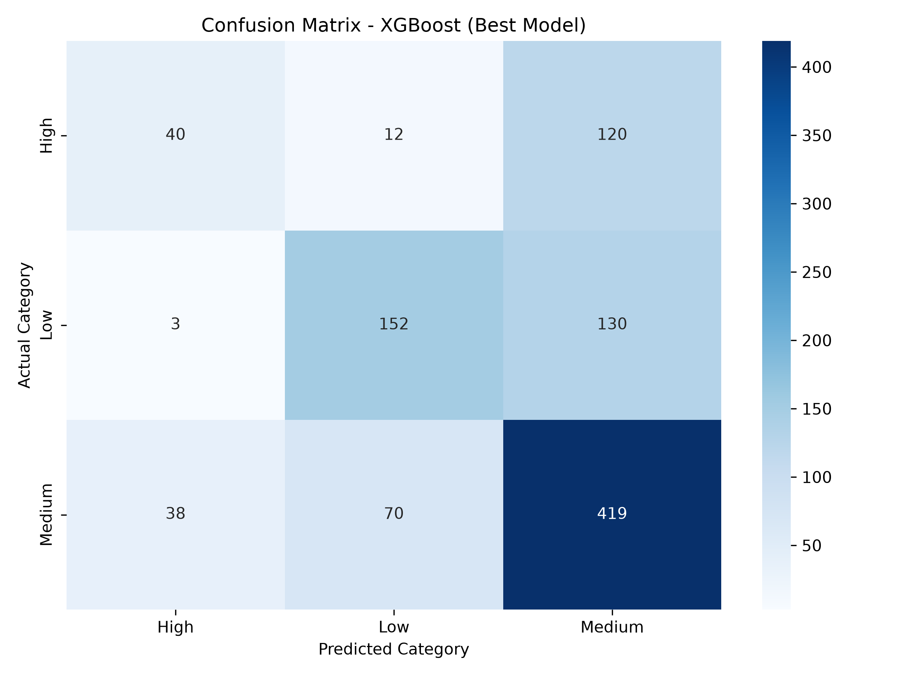
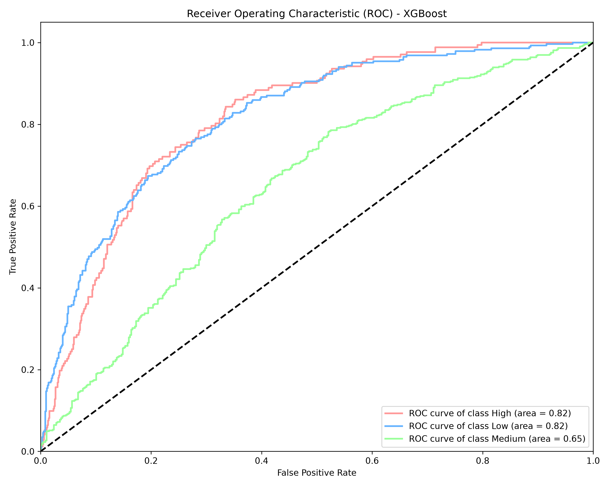

# MovieMeter – AI-Powered IMDb Rating Category Predictor

MovieMeter is an end-to-end Machine Learning MVP designed to estimate the expected IMDb Rating Category (**High, Medium, or Low**) for a movie before its release. It assists OTT platforms, distributors, and marketing agencies in content analysis, purchase decisions, recommendation engines, and targeted marketing strategy optimization.

---

## 📌 Problem Statement

The goal is to build a predictive model that estimates the quality category of a movie before release using features such as genre, runtime, release year, language, director, country, and lead cast. 

OTT platforms acquire content under tight budgets and schedules. Estimating a movie's final audience tier beforehand mitigates risk and optimizes acquisition budgets, ad placement, and targeted recommendations.

---

## 🛠️ Proposed Solution & Machine Learning Approach

### 1. Pre-Release Feature Engineering (Avoiding Data Leakage)
To make this model genuinely useful *before release*, we strictly exclude post-release statistics (e.g., gross revenues, number of voter reviews, user ratings). Instead, we use:
- **Reputation Target Encoding:** Smoothed historical average rating for the Director and Lead Actor (computed out-of-fold during training).
- **Social Popularity:** Director and cast historical Facebook likes.
- **Content Attributes:** Run duration, content rating (G, PG, PG-13, R), release year, binarized language, country, and one-hot-encoded top 10 genres.

### 2. Rating Thresholds (Target Classes)
The continuous target `imdb_score` is mapped to three categories:
*   **🔴 Low (IMDb < 6.0):** Poorly rated / bottom ~29% of movies.
*   **🟡 Medium (6.0 ≤ IMDb < 7.5):** Decent watch / middle ~54% of movies.
*   **🟢 High (IMDb ≥ 7.5):** Critically acclaimed watch / top ~17% of movies.

---

## 🏗️ System Architecture & Data Flow



Detailed data sequence flow, machine learning workflow, and component architectures are stored in the [documentation/](file:///c:/Users/Subhaharini/Downloads/Movie%20meter/documentation/) directory.

---

## 📂 Project Structure

```text
Movie meter/
├── data/
│   └── raw/                   # Raw IMDb movie dataset
├── models/
│   ├── preprocessor.joblib    # Preprocessing pipeline and encoders
│   ├── movie_meter_model.joblib # Best-performing classifier (XGBoost)
│   ├── director_actor_maps.joblib # Director/Actor lookup dictionaries for likes and ratings
│   ├── label_encoder.joblib   # LabelEncoder for target variable
│   └── model_comparison_metrics.csv # CSV file showing evaluation metrics
├── utilities/
│   ├── data_loader.py         # Downloads and loads raw data
│   ├── preprocessor.py        # Cleans, imputes, and engineers features
│   └── model_trainer.py       # Trains, compares classifiers, and saves the best model
├── assets/
│   ├── eda_plots/             # EDA visual plots (distributions, correlations, etc.)
│   └── architecture/          # Architecture files and diagrams
├── notebooks/
│   └── eda_and_training.ipynb   # Step-by-step EDA and pipeline workbook
├── documentation/
│   ├── system_architecture.md # Details about overall systems
│   ├── ml_workflow.md         # ML stages
│   └── data_flow.md           # Sequence diagram of data paths
├── app.py                     # Streamlit web application
├── requirements.txt           # Project dependencies
├── .gitignore                 # Files ignored in Git
└── README.md                  # Project documentation
```

---

## 🚀 Model Comparison & Evaluation

Five models were trained and compared under an 80/20 train-test split. Below is the summary table of results:

| Model | Accuracy | Precision | Recall | F1-Score | ROC-AUC |
| :--- | :--- | :--- | :--- | :--- | :--- |
| **XGBoost (Chosen)** | **62.09%** | **0.6098** | **0.6209** | **0.6002** | **0.7292** |
| Random Forest | 59.96% | 0.6073 | 0.5995 | 0.6001 | 0.7403 |
| Gradient Boosting | 59.86% | 0.5878 | 0.5985 | 0.5799 | 0.7215 |
| Logistic Regression | 53.66% | 0.5863 | 0.5365 | 0.5333 | 0.7130 |
| Decision Tree | 51.72% | 0.5415 | 0.5172 | 0.5221 | 0.6545 |

---

## 📊 Visualizations

### IMDb Score Distribution


### Class Balance (Rating Category)


### Confusion Matrix (Best Model)


### ROC Curve (Best Model)


---

## 💻 Tech Stack
- **Languages:** Python (v3.14.6)
- **Data Engineering:** Pandas, NumPy
- **Machine Learning:** Scikit-learn, XGBoost, Joblib
- **Visualization:** Matplotlib, Seaborn
- **User Interface:** Streamlit (Custom Glassmorphism styling)

---

## ⚙️ Installation & Setup (Local Run)

Follow these steps to set up and run the application locally:

### 1. Clone the Repository
```bash
git clone https://github.com/subhaharinioffi/movie_meter.git
cd "Movie meter"
```

### 2. Install Dependencies
Make sure you have python installed, then install all requirements:
```bash
pip install -r requirements.txt
```

### 3. Run Training Pipeline (Optional)
If you wish to retrain the models and re-generate the artifacts:
```bash
python utilities/model_trainer.py
```

### 4. Launch the Web Application
Start the Streamlit local dev server:
```bash
streamlit run app.py
```
Open the provided local URL (usually `http://localhost:8501`) in your browser.

---

## 🔮 Future Enhancements
1. **Real-time API Ingestion:** Automate movie name search using the TMDB API to scrape official genres, cast, and crew details dynamically.
2. **Deep Learning Integration:** Feed poster artwork into a Convolutional Neural Network (CNN) to predict movie sentiment/likes from visual styling.
3. **Sentiment Analysis:** Extract text sentiment features from pre-release trailers, trailer comments, and social media tweets.
4. **Inflation-Adjusted Budgets:** Clean and normalize international currencies to include a robust financial ratio as an additional feature.
